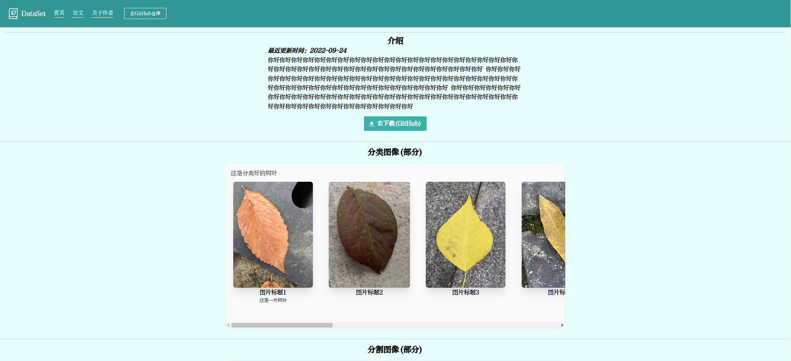
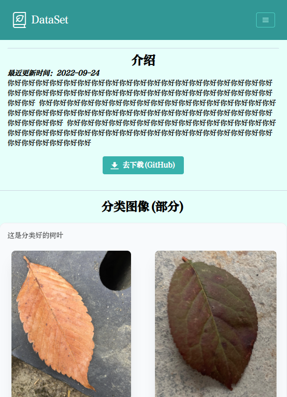

# dataset-jekyll 模板
***
- 本模板不需要像GitHub给的主题一样用gem管理插件，克隆本仓库，然后直接调试:
```angular2html
jekyll serve --livereload
```
或者
```angular2html
bash run.sh
```

- 查看[示例模板](https://foreverlz1111.github.io/dataset_jekyll/)
- 
### 截图
- 横屏

- 竖屏

### 引入本地文件
- (官方提供的引入本地css)错误用法：
```angular2html
<link rel="stylesheet" href="/assets/css/love.css">
<!- 部署后永远找不到这个路径，调试可用 -->
```
- 正确用法：
```angular2html
<link rel="stylesheet" href="assets/css/love.css">
```
- 引入本地图片正确用法为:
```angular2html

```
- 引入链接路径:
```angular2html
<a href="">首页</a> <!- 正确！ -->

<a href="/">首页</a> <!- 错误！ -->
```
### 新增和修改
- markdown文件为_layout文件夹中html的前端。编辑根目录index.md文件( --- 也包括在内)，将其指向_default/default.html:
```angular2html
---
layout: default
something: "better"
---
```
- 在_default/default.html中使用markdown文件定义的常量：
```
<p>{{page.something}}</p>  <!- 会得到输出better -->
```
***
- _layout文件夹为页面，通过设计_include内html组件并在页面中引用:
```
<!- 这里是default.html。我要引用_include文件夹中的eye.html，顺便传点常量过去给它 -->
<body>

</body>
```
```angular2html
<!- 这里是eye.html ，现在可以用刚刚传过来的变量，实际输出内容为 to_there -->
<body>
<p>{{ include.word }}</p>
</body>
```

### How jekyll design template,unfortunately they do not

  
